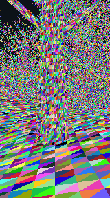

# Forest emulation and renderer audit

## Outcome

The project now has a repeatable CPU workload model and a software Vulkan harness that executes the forest's raster WGSL. This audit did not change the deployed renderer. Two harness-only experiments identified much larger savings than the previous per-tile rejection work: dispatch only visible meshlets, and reject triangles whose screen-space bounds contain no pixel centre before allocating bin entries.

### Measured shader execution, not an FPS estimate

Real 256-tree forest buffers, full geometry, 160×288, spawn position, pitch −0.05, no diagnostic counters. SwiftShader CPU adapter through wgpu 0.32.0; one warmup and one subsequent measured frame per variant. Selection was supplied by the CPU equivalent of the app's culling stage. The raster shader math is the production math, except the explicitly labelled empty-bounds experiment. Terrain/tree vertex arrays were concatenated solely to fit SwiftShader's 10-storage-buffer limit. No adapter limit was overridden.

| Original raster shader / harness configuration | Bin stage | Raster stage | Sum of compute stages | Bin entries | Batches |
| --- | ---: | ---: | ---: | ---: | ---: |
| Current capacity-sized dispatch | 4,018 ms | 1,038 ms | 5,056 ms | 1,474,026 | 46,469 |
| Dispatch only visible meshlets | 558 ms | 1,021 ms | 1,579 ms | 1,474,026 | 46,469 |
| Visible dispatch + empty pixel-centre bounds rejection | 535 ms | 245 ms | 780 ms | 213,768 | 7,092 |

All configurations produced the same depth/ID checksum: `e684cb911211e8dd184928e033327505cb6bbfee641050622a42c7da509f1a72`. All four production raster variants also matched one another on this software-adapter scene. The two experiments together were about 6.5× faster **on this CPU software adapter**. That is not a phone speedup claim. Small timing differences are noisy; the first all-variant sweep overlapped the CPU model and is archived separately. The capacity/visible/empty-bounds comparisons were rerun without that background replay. Actual frame rendering, Three's hardware sky/water, screen presentation and Android scheduling are excluded.

Raw runs: [capacity](emulation-gpu/capacity.json), [visible dispatch](emulation-gpu/visible.json), [visible + empty bounds](emulation-gpu/visible-empty-bounds.json), [instrumented](emulation-gpu/visible-instrumented.json), [initial four-variant sweep](emulation-gpu/all-variants-initial.json).

## CPU workload replay

Both views use the actual high-density forest, all 256 tree instances, full-detail geometry and 384×704 pixels. Camera positions/settings are recorded in the JSON; these are reproducible views, not reconstructed screenshot cameras. Original/owned/cached/reject outputs match across all pixels in each replay. Six pixels per variant additionally use exhaustive scanning, bypassing bins and masks. Synthetic tests cover partial tiles, ties, opposite insertion order and empty bounds.

| Work in the spawn replay | Original | Owned masks | Tile rejection |
| --- | ---: | ---: | ---: |
| Selected padded triangle slots | 2,681,472 | 2,681,472 | 2,681,472 |
| Bin + repeated raster setup calls | 4,323,940 | 4,323,940 | 4,204,267 |
| Fine coverage tests | 2,144,770 | 2,144,770 | 1,438,966 |
| Shared candidate mask-word reads | 0 | 105,117,952 | 97,458,880 |
| Global diagnostic atomic adds on sampled frames | 307,067 | 307,067 | 13,210,277 |

The rejection path eliminates about 33% of fine coverage tests but only 2.8% of triangle setup calls. It does not eliminate the large mask transpose loop. Diagnostics on sampled frames introduce millions of additional global atomics. These are logical source-level work counts, not cache misses, bandwidth measurements or cycle predictions. Repeated projected triangles are memoized in the CPU tool to make replay practical, while repeated shader setup is counted analytically.

Capacity-sized bin dispatch launches 29,359,680 invocations in both views. Only 2,681,472 reach setup in the spawn view (1,049,920 in the canopy view); the remainder return immediately. Padding itself is much smaller: 31,884 slots in spawn, about 1.2% of selected slots. Thus padding removal alone is not the main fix.

Raw replays: [spawn](emulation-spawn/report.json), [canopy](emulation-canopy/report.json). Source-file hashes are included. The CPU model does not reproduce GPU atomic insertion order, FMA/rounding, hardware rasterization or full-scene pool-overflow scanning. It aborts explicitly on pool overflow rather than silently truncating geometry. The shader harness confirms raster execution for the supplied scene, not all possible geometry.

## Audit coverage and findings

| Code area | Files | Finding |
| --- | --- | --- |
| Source scene and camera | `forestScene.js`, `gameScene.js`, `gameControls.js`, `main.js` | Deterministic shared tree mesh and instance positions. Geometry construction is startup/rebuild work. Game controls reset to terrain height + 1.7 m and pitch −0.05. Screenshot positions are not recoverable exactly. |
| Geometry preprocessing | `partitionMeshlets.js`, `buildNaniteLiteAsset.js`, `buildHierarchyAsset.js`, `config.js` | Meshoptimizer WASM preprocessing, shared source vertices, fixed 64-triangle slots. Full-detail mode compiles out patch LOD selection; hierarchy remains separate. CPU emulator uses these actual builders. |
| GPU selection | `NaniteLiteRenderer.js`, `ForestRenderer.js` | Group and meshlet frustum/cone culling. No active forest HZB. Full-detail visible lists reserve all source meshlet instances. Hardware full-detail uses indexed instances; its submitted triangle count is not hardware-rasterized fragment count. Selection is CPU-emulated; native harness starts from those lists. |
| Binning | All four `forest*Shaders.js` | Dispatch uses maximum list capacity instead of current count. Every surviving triangle's screen AABB allocates tile entries even if it contains no pixel centre. Bin processing also computes triangle normal, colour and distance before visibility rejection. |
| Raster masks and depth | All four forest shaders; `reference.js`, `tileReference.js` | Original repeats depth work; owned masks trade atomics for a 64×candidate shared-read transpose; cached raises workgroup storage; reject adds buckets, depth reductions and diagnostics. Triangle setup repeats per tile entry. All actual shader variants agreed on the tested software-adapter frame. |
| Frame scheduling | `FrameExperiment.js`, `frameMeter.js`, `main.js` | One/two queued frames are bounded. CPU cadence is distinct from GPU timing. Timestamp markers/readbacks add profiling work. Diagnostic counter overhead remains independent of the GPU timing toggle. |
| Uploads/readbacks | `ForestBitmaskRenderer.js`, `NaniteLiteRenderer.js` | Source geometry uploads on pipeline creation; per-frame updates are uniforms and GPU-resident visible lists, plus small asynchronous statistics copies. No per-frame geometry streaming path was found. Rebuild peak memory and steady-state bandwidth are different issues. |
| Presentation and shading | `ForestRenderer.js`, `ForestBitmaskRenderer.js`, `NaniteLiteRenderer.js` | Sky/water pass, forest depth composite, optional final screen copy. Compute averages triangle colours/normals with simplified lighting; hardware uses MeshStandard shading. This explains a real visual difference, not evidence of missing geometry. Direct presentation may change MSAA/precision. These passes are audited, not software-emulated. |
| Controls and isolated test | `ui.js`, `styles.css`, `bitmask/test.js`, `shaders.js`, `fixtures.js`, `index.html`, `bitmask.html` | Geometry/raster controls are separate. Isolated fixtures exercise overflow and mask rules; they do not reproduce forest cost. Mobile overlay can obscure the rendered view. |
| Validation and packaging | `tests/*`, `scripts/validate.mjs`, `vite.config.js`, package files | Existing tests plus emulator equivalence/empty-bounds tests; pinned Three/Vite. Naga parser checks are distinct from actual shader execution. No native GPU browser run is claimed. |

## Next implementation, based on evidence

1. Generate `dispatchWorkgroupsIndirect` arguments from visible counts on the GPU. Use a separate indirect buffer and preserve the bin kernel's 2D indexing. Do not add a CPU readback dependency just to shrink dispatch.
2. Before bin allocation, conservatively reject `any(ceil(lo - 0.5) > floor(hi - 0.5))`. This skips triangles with no possible pixel-centre sample; it is not an arbitrary small-triangle size cutoff. The harness demonstrated identical output and about 85.5% fewer entries in its small-viewport test.
3. Make expensive work counters independently switchable and preferably aggregate them. Keep diagnostic overhead out of production FPS comparisons.
4. Re-measure on the phone before choosing a mask algorithm or adding more culling. Repeated setup/normal/shading fetches are next candidates only after the two large avoidable costs are removed.

Reproduce with [the harness instructions](../scripts/emulation/README.md), `npm run emulate -- --pitch=-.05`, and the optional SwiftShader runner. Driver binaries and large source-buffer exports are not committed; the deterministic exporter regenerates them.

## Production integration: selectable bounded variant

The main forest now offers **Bitmask · visible dispatch + pixel bounds** independently of geometry LOD. Original variants remain available. `forestBoundedShaders.js` retains reference rasterization and adds the empty pixel-centre bounds test in binning. A separate compute pass reads the GPU-visible counts and writes a dedicated STORAGE|INDIRECT buffer; the bin pass consumes it with `dispatchWorkgroupsIndirect`. No CPU count readback or additional scene render is introduced.

Actual production shader execution in SwiftShader: 42,990 dispatched workgroups, 213,768 entries, 7,092 batches, no overflow. Measured second iteration: bin 513.02 ms, raster 266.50 ms; frame wall time 780.33 ms. Depth/ID SHA256 remains `e684cb911211e8dd184928e033327505cb6bbfee641050622a42c7da509f1a72`. These are software-adapter results, not browser or phone FPS. See `emulation-gpu/indirect-bounded.json` and `scripts/emulation/check-dispatch.py` for the production argument-generation boundary checks.
